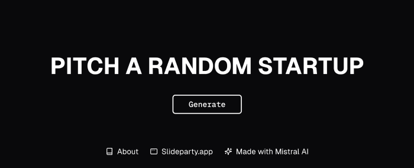
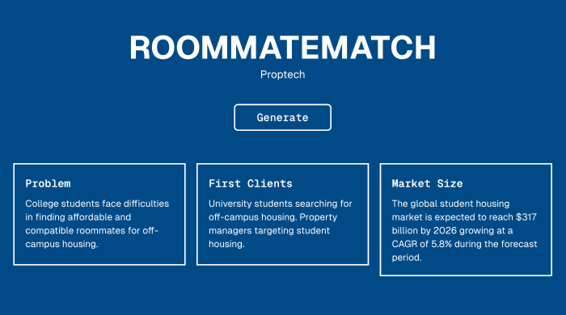

# Ignite 🛗

Ignite is a fun wbesite that **generates random startup concepts** to train yourself to pitch new business ideas. It is part of my job application to work at Mistral AI.



This project has been finalized over the course of 7 hours. It is based on **Next.js** and **Mistral AI**. The UI has been made with **Shadcn/ui**, **TailwindCSS** and **Lucide Icons**. Global state is handled by **Zustand**.

## Getting Started

First, clone the repo and open it in your favorite code editor.

### File Structure

- Pages in `/app`
- Components in `/components`
- AI API calls and Data Store in `/store`
- Utils in `/lib`

### Add your Mistral API key

Create a `.env.local` file and put the following environment variable:

```
NEXT_PUBLIC_MISTRAL_API_KEY=your_mistral_api_key
```

You can obtain an API key by heading to [https://console.mistral.ai/api-keys/](https://console.mistral.ai/api-keys/) and select the free plan.

### Install packages and run the dev the server

Run the following commands.s

```bash
# install packages
yarn
# run the development server
yarn dev -p 3000
```

Open [http://localhost:3000](http://localhost:3000) in your browser to see the result.

## Make a production build

To make sure there's no error during compilation and server side rendering, execute the following command.

```bash
yarn build
```

If everything is ok, you're ready to deploy. But never share your API credentials publicly.

## Deploy on Vercel

Check out [Next.js deployment documentation](https://nextjs.org/docs/app/building-your-application/deploying) for more details.
Don't forget to add the Mistral API key to Vercel environment variables for production builds.

## Screenshot



## Author

William BRISA, created and last edited 15/01/2025
